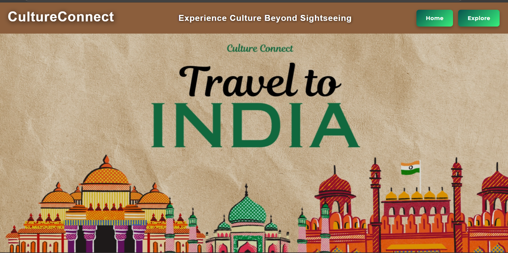
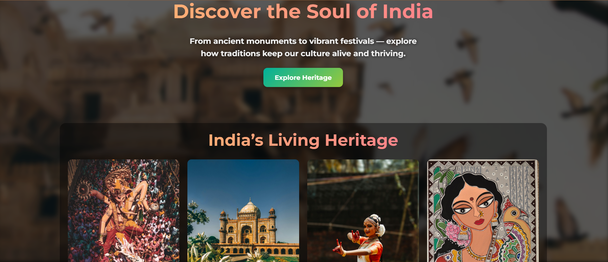
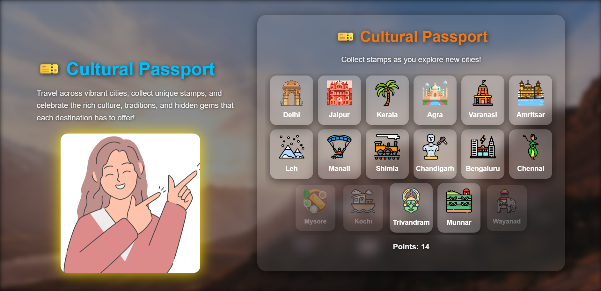

# 🪷 Culture Connect  
### A Journey Through India’s Heritage and Diversity  


---

## 🧭 Overview  
**Culture Connect** is a web application that celebrates the rich cultural diversity of India.  
It allows users to explore different cities, learn about their traditions, food, and art, and collect virtual **“stamps”** in a Cultural Passport.  
It combines interactive design, a mini-quiz, and an engaging layout to make learning about India **fun and visual**.

---

## ✨ Features  

- 🏙️ **Explore Section** — Browse Indian cities and discover their culture, monuments, and cuisines.  
- 🎫 **Cultural Passport** — Collect digital stamps for each city you visit.  
- 🧠 **Interactive Quiz** — Test your knowledge of Indian heritage and earn rewards.  
- 🎥 **Immersive Visuals** — Background videos and images to enhance user experience.  
- 🌐 **Responsive Design** — Fully optimized for different screen sizes.  
- ⚙️ **Modular Codebase** — HTML, CSS, and JS separated cleanly for scalability.

---

## 🏗️ Project Structure  
```Culture Connect/
│
├── index.html
│
├── html/
│   ├── explore.html
│   ├── passport.html
│   ├── quiz.html
│   ├── about.html
│   └── contact.html
│
├── css/
│   └── style.css
│
├── js/
│   ├── main.js
│   ├── explore.js
│   └── quiz.js
│
└── assets/
    ├── images/
    └── videos/

---
```
## 🛠️ Technologies Used  

- **HTML5** – Structure and layout  
- **CSS3** – Styling, animations, and responsive design  
- **JavaScript (ES6)** – Interactive functionality and DOM manipulation  

---

## 🚀 How to Run Locally  

1. **Clone the repository**  
   ```bash
   git clone https://github.com/muskan-codes-22/Culture-Connect.git
   ```
2. **Open the project folder**
```
cd Culture-Connect
```
4. **Run the app**
Simply open index.html in your browser.

---

## 🧩 Future Improvements

 - Add backend (Node.js + MongoDB) for saving user progress.

 - Include user login and personalized passport collection.

- Integrate APIs for real cultural event updates.

- Add sound effects and background music toggle.

---

## 📸 Preview

This is landing page 


Home page


Passport page



## 💡 Motivation

India is a land of unity in diversity — this project aims to help users connect with its culture through interactive storytelling, visuals, and gamified exploration.

---

## 🧑‍💻 Author

Muskan Kumari
Full-Stack Developer & Student — Passionate about building web experiences that educate and inspire.
